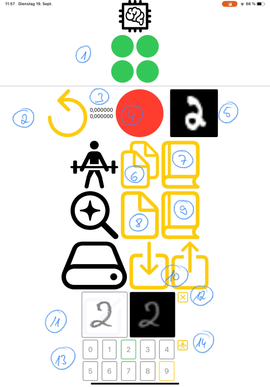

# AIplay
A lab for playing around with AI concepts. The lab intends to gain some practise in implementing running programs of straight forward examples for Neural Networks and Deep Learning.

## MYONN
A SwiftUI implementation of Make Your Own Neural Network. The app downloads the MNIST dataset and enables training and prediction using the files included in the set. A sketch area accepts handwritten input for prediction. There are save and load functions for trained models in a simple and convenient format.

The app features stochastic gradient descent (SGD) and mini-batch which is the default. Size is a hard-coded value of 30. To make use of SGD set `miniBatchSize` in `NetworkView.swift` to 1. Mini-batch makes use of any available cores. To enable Metal compute shader for the activation function set `tryOnGpu` in `Network.swift` to `true`.

The hard-coded network configuration is 784/ 100/ 10 fully-connected input/ hidden/ output nodes with Sigmoid activation.

### Usage
On the first start the app asks for a folder to store the MNIST dataset. The four MNIST status indicators turn into green when all files have been downloaded and unzipped. Training the whole dataset took between 30 (mini-batch) and 45 (SGD) minutes on an iPad Pro 2022.

Input from the sketch area must be centered with some padding to the edges. Ideally, the images on the input and query monitors will look quite similar.

1. The MNIST dataset state. Each circle represents one of the files that make up the dataset: training images, training labels, test images and test labels. The colors are yellow when loading, green when successful, and red when error occurs.
2. Reset the network. No additional confirmation. Any training is immediately canceled.
3. The number above is the test set performance of the current network. Below is the time it took to train the network with the training set (duration).
4. The success indicator for the last prediction with a single element from the test set.
5. The query monitor displays the MNIST image used by the last test set prediction.
6. Train the network sequentially with the next mini-batch from the training set.
7. Train the network with the entire training set. Updates the duration when the operation completes.
8. Query the network for a random element from the test set (predict output). Updates success indicator and query monitor.
9. Query the network with the entire test set. Updates performance when the operation is complete.
10. Save and load the current network to and from the hard drive.
11. The sketch area for handwritten input with a monitor next to it.
12. Control to delete sketch area.
13. The highlighted result with prediction for sketch region input.
14. Control for training the network with selected (green) result.

**Working**
- MNIST loading/ training/ predicting
- Save/ load trained model (proprietary format)
- Predict handwritten input

**Wanted**
- Better UX
- Configuration UI
- Save/ load in common format
- CoreML usage
- Metal compute shader usage (extended)
- More activation functions
- More layer types

### Tools
Apps used on iPad
- [Swift Playgrounds 4](https://apps.apple.com/de/app/swift-playgrounds/id908519492) (SP4)
- [Working Copy](https://workingcopyapp.com/) (WC)
- [Textastic](https://www.textasticapp.com/)
- [GitHub](https://apps.apple.com/us/app/github/id1477376905)

### Build
- Create and open a new app in SP4
- Delete predefined `*.swift` files
- Copy files (except `Package.swift` and Git stuff) from repository:
  - Get repository on iPad (Working Copy)
  - Copy Sources folder from WC to SP4 (Textastic)
- Add `additionalInfoPlistContentFilePath`, `resources` and `swiftSettings` keys to `Package.swift` in new app
  - Lookup key templates in repository's `Package.swift`
- Add [Playgrounds tester package](https://github.com/Losiowaty/PlaygroundTester.git)
- Add [Data compression package](https://github.com/mw99/DataCompression.git)

### Which file for what
|File|Comment|
|:---|:------|
|AIplay.swift|The main program.|
|CustomCoder.swift|An encode/ decode implementation.|
|FolderPicker.swift|A view. The function is in the name.|
|GaussianDistribution.swift|A class to provide random floats with normal distribution.|
|Matrix.swift|A somewhat pimped Array for matrix operations. Leverages vDSP.|
|MNISTDataset.swift|MVVM to put MNIST on disk.|
|MYONNView.swift|The top-level view.|
|Network.swift|The network implementation from MYONN book. Also includes Metal compute shader code.|
|NetworkView.swift|MVVM to make use of network in SwiftUI.|
|QueryView.swift|The sketch area view for handwritten input.|
|MYONN-B30-0300-001-01.nnxd|Model in Neural Network Exchange Document (nndx) format. First functioning training. Mini-batch (size 30), learning rate 0.3, 1 epoch. Testset performance 0.9073.|
|MYONN-B30-0300-001-02.nnxd|Model in Neural Network Exchange Document (nndx) format. First functioning training with Swift concurrency. Mini-batch (size 30), learning rate 0.3, 1 epoch. Testset performance 0.8942.|
|MYONN-SGD-0300-001-01.nnxd|Model in Neural Network Exchange Document (nndx) format. First functioning training. Stoachstic gradient descent, learning rate 0.3, 1 epoch. Testset performance 0.9444.|
|MYONN-SGD-0300-001-02.nnxd|Model in Neural Network Exchange Document (nndx) format. First functioning training with Swift concurrency. Stoachstic gradient descent, learning rate 0.3, 1 epoch. Testset performance 0.9424.|

### References
- [Code Your Own Neural Network](https://www.amazon.de/Code-Neural-Network-step-step-ebook/dp/B00TXPGEHG) by Stephen C. Shaffer. A short but nevertheless valuable breviary with focus on practice.
- [Make Your Own Neural Network](https://www.amazon.de/-/en/Tariq-Rashid/dp/1530826608) by Tariq Rashid. A little more verbose than Shaffer with detailed step-by-step explanations yielding a network that recognizes handwritten digits.
- [The Architecture of Mind](http://faculty.otterbein.edu/dstucki/INST4200/Rumelhart.pdf) by David E. Rumelhart. Paper on back-propagation written by the inventor. Worth a reading.
